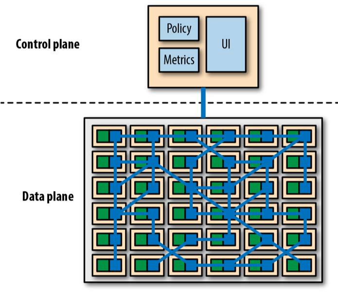
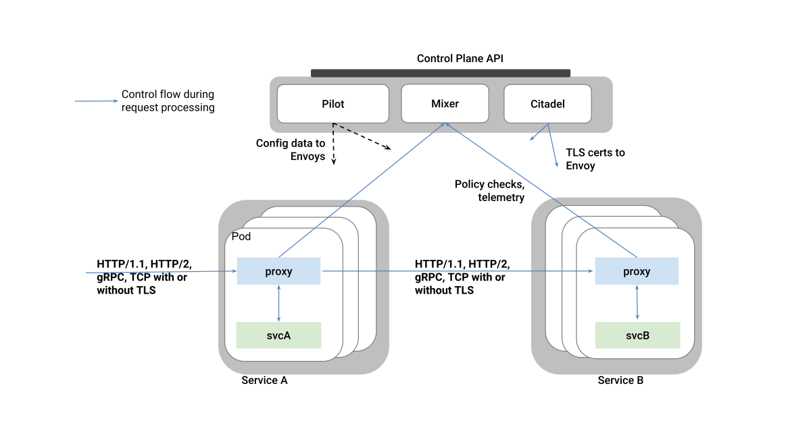

# Istio

## Service Mesh
[WHAT’S A SERVICE MESH? AND WHY DO I NEED ONE? - buoyant.io](https://buoyant.io/2017/04/25/whats-a-service-mesh-and-why-do-i-need-one/) - William Morgan, Buoyant

A **service mesh** is a dedicated infrastructure layer for handling **service-to-service communication**.

- The **data plane** is composed of a set of intelligent proxies (Envoy) deployed as sidecars.
- The **control plane** manages and configures the proxies to route traffic.

**Istio** is a completely open source service mesh that layers transparently onto existing distributed applications.

## Envoy
[Envoy](https://envoyproxy.github.io/envoy/) is a high-performance proxy developed in C++ to mediate all inbound and outbound traffic for all services in the service mesh.

## Pilot
[Pilot](https://istio.io/docs/concepts/traffic-management/#pilot) provides service discovery for the Envoy sidecars, traffic management capabilities for intelligent routing (e.g., A/B tests, canary rollouts, etc.), and resiliency (timeouts, retries, circuit breakers, etc.).

## Mixer
[Mixer](https://istio.io/docs/reference/config/policy-and-telemetry/) enforces access control and usage policies across the service mesh, and collects telemetry data from the Envoy proxy and other services.

## Citadel
[Citadel](https://istio.io/docs/concepts/security/) enables strong service-to-service and end-user authentication with built-in identity and credential management.

## Sidecar

## Setup
https://istio.io/docs/setup/

## Reference
- [Jimmy Song](https://jimmysong.io/en/)
- [Istio Handbook](https://github.com/servicemesher/istio-handbook)
- [Microservices in a Post-Kubernetes Era](https://www.infoq.com/articles/microservices-post-kubernetes/)

